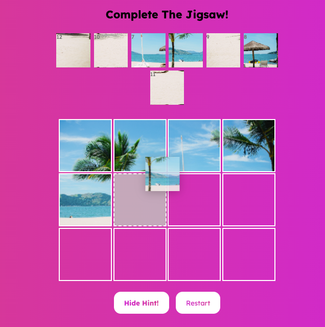

# Jigsaw Drag 'n Drop
My first web development project, from May 2021, experimenting with drag and drop event listeners, as well as HTML, CSS and Javascript!

<p align="center">
  
  
</p>

<p align="center">
  
  
</p>

#### Event listeners used
```
for (const box of boxes) {
  box.addEventListener('dragstart', dragStart);
  box.addEventListener('dragenter', dragEnter);
  box.addEventListener('dragover', dragOver);
  box.addEventListener('dragleave', dragLeave);
  box.addEventListener('drop', dragDrop);
  box.addEventListener('click', jigImgClick);
}
```

## Installation
1. Clone this repo
2. Run `live-server` in the command line

## Features
* After dropping an image from the pile to a jigsaw box, it’ll be removed from the pile.
* If clicking on the (filled) jigsaw box (or dragging and dropping another image over it), that ‘jigsaw piece’ image will be returned to the pile.
* If hovering over an empty jigsaw box with an image: the box will have a grey background and dotted border.
* User can (toggle to) show and hide hints (grey numbers in top left corner of image, which disappears when that image is dropped into jigsaw).
* Once the jigsaw is filled, the jigsaw pieces' borders disappear and the entire complete image is shown.
* The user can click restart to return all jigsaw pieces to the pile and start again.

## Future Improvements & Bugs
### Future Improvements:
* Implement logic to check that the jigsaw has been completed successfully (image in the right order). Currently, whether or not the jigsaw is correct, the borders will disappear and the completed (jumbled) image shows.
### Bugs:
* Each empty jigsaw box can be dragged to another one...
* If the hints are shown, and a jigsaw piece is returned to the pile, that returned image will *not* show the hint.